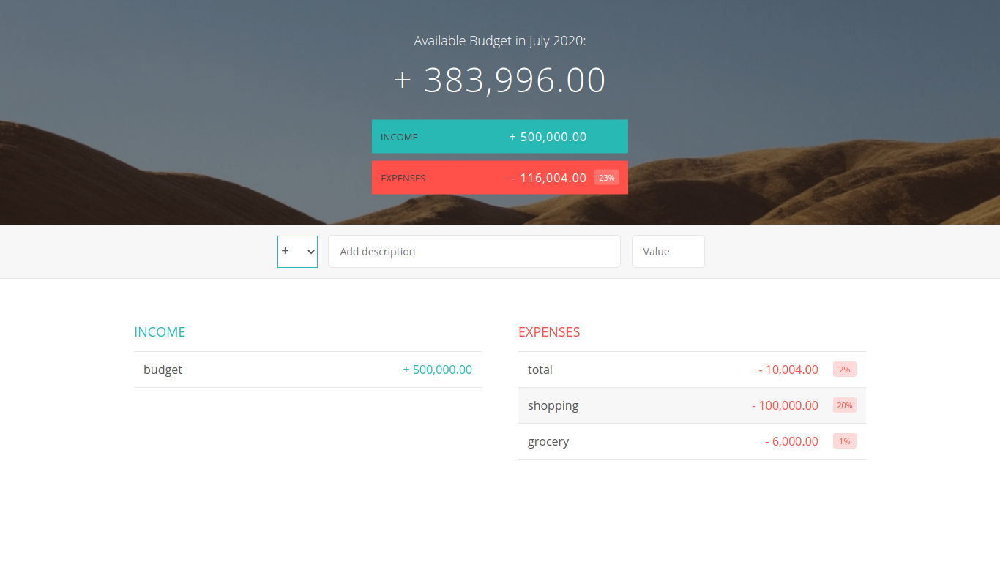
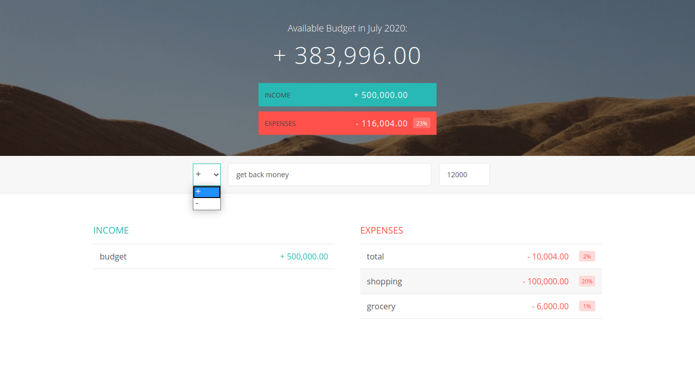
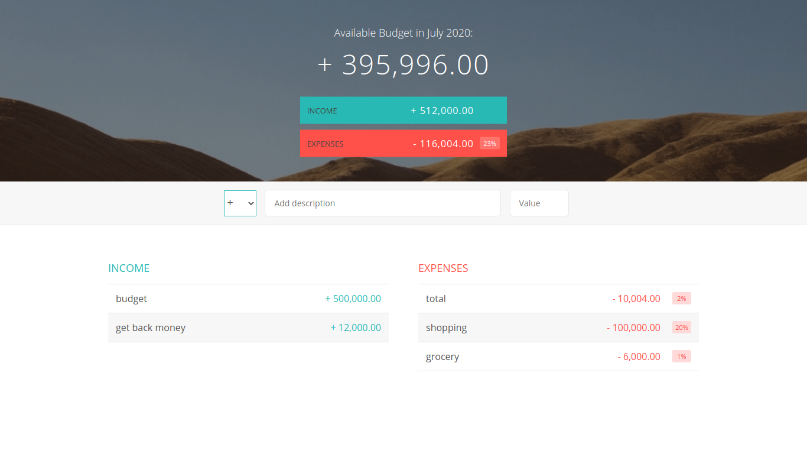

# Budget Web Application

* Designed the budget app in 3 days by myself.
* Budget app helps to maintain the overall record to expense.

# Idea 

* Budget app is basically a calculator, which helps the users to maintain their expenses on daily bases. 
* Idea behind to build this budgetapp was in the intially of the month we spend a lots a money. So, this will help to maintain the record bases on your income.

# Features

* Users able to enter their income and expense details.
* According to the spended money, it calculate the overall value.
* User able to set the budget app month date.

# How to use?

* Click me: <a href="https://swati-budgetapp.netlify.app/">https://swati-budgetapp.netlify.app/</a>

   ### Steps:
   
   * First choose the sign(+/-) + is for income and - is for expense.
   * Add the description.
   * Add the amount.
   * Hit the Enter.
   * You can see the your overall budget left at the top according to their income/expense.

# screenshots

  
  

